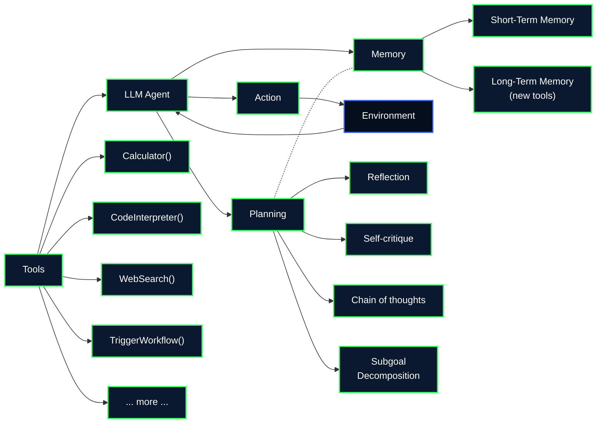
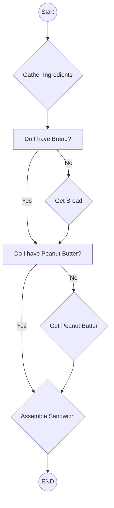

Online course from Berkeley [here](https://llmagents-learning.org/f24)

# Syllabus
| Lecture                                   | Supplemental Reading |
| ----------------------------------------- | -------------------- |
| LLM Reasoning                             |                      |
| LLM Agents: Brief History and Overview    |                      |
| Agentic AI Frameworks & AutoGen           |                      |
| Building a Multimodal Knowledge Assistant |                      |

# Lecture 1: LLM Reasoning
Last Letter Concatenation Problem.

| Input        | Output |
| ------------ | ------ |
| Elon Musk    | nk     |
| Bill Gates   | ls     |
| Barack Obama | ?      |
Adding 'reasoning process' before 'answer' ?
## ==Key Idea==: Derive the Final Answer through Intermediate steps.
	-Ling et al (Program Induction by Rationale Generation: Learning to Solve and Explain Algebraic Word Problems)
	-Cobbe et al. Training Verifiers to Solve Math Word Problems
	-Nyt et al. Show Your Work: Scratchpads for Intermediate Computation with Language Models

Training, Fine tuning and Prompting with intermediate steps.
Examples with intermediate steps.

### Reasoning strategies 
1) Least-to-Most Prompting
2) "Let's think step by step" prompt
3) Recall related problem - adaptively generate relevant examples and knowledge, rather than using a fix set of examples
4) Chain-of-Thought Reasoning without Prompting (Greedy Decoding) ??
5) Self-Consistency
6) Universal Self-Consistency
7) Consensus under debate of multiple LLM
8) Oracle feedback for self-debug (unit tests)
### Test
1) Compositional Generalization
### Limitation
1) Distracted by irrelevant context
2) Cannot self-correct reasoning yet
3) Premise Order Matters in LLM Reasoning

## Concern on generating intermediate steps instead of direct answers ?
1) Probabilistic nature of LLM for token generation

### What LLM does in decoding:
$\text{arg max }\mathbb{P}\text{(reasoning path, final answer| problem)}$
### What we want:
$\text{arg max }\mathbb{P}\text{(final answer| problem)}$
#### One-step Further
$$\text{arg max }\mathbb{P}\text{(final answer| problem)}= \sum_{\text{reasoning path}} \mathbb{P}\text{(final answer| problem)}$$
## **Summary**
- Generating intermediate steps improves LLM performance
    - Training / finetuning / prompting with intermediate steps
    - Zero-shot, analogical reasoning, special decoding
- Self-consistency greatly improves step-by-step reasoning
- Limitation: irrelevant context, self-correction, premise order
### What are next? 
1) Define a right problem to work on
2) Solve it from the first principles

# Lecture 2: LLM Agents: Brief History and Overview
Agent:
	an intelligent system that interacts with some enviroment

**Types of Task**
1) Reasoning 
2) Knowledge - can be augmented with RAG
3) Computation

**Tools**
1) Search Engine, Calculator
2) Task-specific models
3) APIs
## Question and Answer Breakdown
1) Symbolic Reasoning
2) Mathematical Reasoning
3) Commonsense QA
4) Knowledge-intensive QA
5) Multi-hop knowledge-intensive QA

### Potential Tools
1) Chain of Thought
2) Tool use
3) RAG
4) Program of Thought
5) WebGPT
6) Self-ask
7) IRCoT

### ==ReAct== = Reason and Act
- cannot explore systematically or incorporate feedback
- own context space is infinite size, changed when doing the thinking
- reasoning is an internal action for agents

## Memory
### Short-Term Memory
- append-only
- limited context
- limited attention
- do not persist over new tasks
### Long-Term Memory
- read and write
- stores experience, knowledge, skills
- persist over new experience
### Reflexion
1) Task
2) Trajectory
3) Evaluation
4) Reflection (find which unit test fail from a coding example)
How does it update the memory ? 

### Cognitive Architectures for Language Agents (CoALA)
Any agent can be described with 
1) Memory
2) Action Space
3) Decision Making

#### Q
1) What distinguishes external environment vs internal memory ?
2) What distinguished long vs short term memory ?

Symbolic AI Agent -> Deep RL Agent -> LLM Agent
Language is the latent space for LLM Agents.

## Challenge
1) Reasoning over real-world language
2) decision making over open-ended actions and long horizon

## What's Next ?
1) Training - FireAct: Toward Language Agent Fine-tuning
2) Interface - SWE-agent: Agent-Computer Interfaces Enable Automated Software Engineering
3) Robustness - ==how many pass out of k?==
4) Human - $\tau$-bench: A Benchmark for Tool-Agent-User Interaction in Real-World Domains
5) Benchmark

https://princeton-nlp.github.io/language-agent-impact/
EMNLP tutorial on language agents (Nov12-16), sorry bois, the visa prob won't work out

# Lecture 3a: Agentic AI Frameworks & AutoGen
Generative -> Agentic
Self-Healing code

Commander -> Writer -> Safeguard
## Multi-Agent Orchestration
- static/ dynamic
- NL/ PL
- context sharing/ isolation
- cooperation/ competition
- centralize/ decentralized
- intervention/ automation
## Agentic Design Patterns
- conversation
- prompting & reasoning
- tool use
- planning
- integrating multiple models, modalities and memories
## AutoGen Framework
1) define agents
2) get them to talk
### Conversation Type
1) Blogpost writing with reflection
2) Nested chat -> multiple experts to do reflection
3) Conversational with tools 
4) Group chat
# Lecture 3b: Building a Multimodal Knowledge Assistant
Knowledge Base -> Vector Database via chunking
## Knowledge Assistant with Basic RAG
### Data Processing and Indexing
Data -> Basic Text Splitting -> Index
### Basic Retrieval and Prompting
Top-5 = 5 Simple QA Prompt -> Response
### Limitations
1) Naive data processing, primitive retrieval interface
2) Poor query understanding/ planning
3) No function calling or tool use
4) Stateless, no memory
## A Better Knowledge Assistant
1) High-quality Multimodal RAG
2) Complex output generation
3) Agentic reasoning over complex inputs
4) Towards a scalable, full-stack application

Data -> Data Processing -> Index -> Agent -> Response

## Setting up Multimodal RAG
1) ETL for LLMS
	- parsing
	- chunking
	- indexing
2) Complex Documents -> embedded tables, charts, images, irregular layouts, headers/footers
3) LLM-Native Document Parser
4) Agentic RAG
5) Unconstrained vs Constrained Flows

## Agentic Orchestration Foundations
- event-driven
- composable
- flexible
- code-fist
- debuggable and observable
- easily deployable to production

Multimodal Report Generation -> Final System ?
# Lecture 4: Enterprise trends for generative AI, and key components of building successful agents/ applications

- needle in a haystack test
## Trends
1) AI moving faster
	- amount of data needed has come down
	- anyone can develop AI with new tools
2) Technical
	- multimodal
	- ==efficient sparse models== 
3) Platform
	- broad set of models
	- customization
4) Cost of API Call -> $0
5) Search -> ==LLM and Search==
6) Enterprise Search/ Assistant
## Customization
- Fine Tuning
- Distillation
- Grounding 
- Function Calling
- Prompt Design vs Prompt Tuning
### Fine Tuning
- Parameter-efficient Fine Tuning ==(PEFT)==
- Low Rank Adaptation ==(LoRA)==
### Distillation
- teacher-student model
- softmax function with temperature
### Grounding
#### Minimize Hallucination
- right context
	- Retrieval Service
	- dynamic retrieval
- better models
- user experience

### Function Calling

# Lecture 5: Compound AI Systems & the DSPy Framework
	modular programs that use LMs as specialized componenets

==Monolithic== nature of LMs makes them hard to **control**, **debug** and **improve**.

## Retrieval-Augmented Generation
- Transparency: can debug traces & offer user-facing attribution
- Efficiency: can use smaller LMs, offloading knowledge & control flow

## Multi-Hop Retrieval-Augmented Generation
- control: can iteratively improve the system & ground it via tools

## Compositional Report Generation
- quality: more reliable composition of better-scoped LM capabilities
- inference-time scaling: systematically searching for better outputs
	- DIN-SQL

## Role of Prompt
1) The core input-> output behavior, a ==signature==
2) The computation specializing an inference-time strategy to the signature, a ==predictor==
3) The computation formatting the signature's inputs and parses it typed outputs, an ==adapter==
4) The computations defining objectives and constraints on behavior, ==metrics== and ==assertions==
5) The strings that instruct (or weights that adapt) the LM for desired behavior, an ==optimizer==

## What if we could abstract Compound AI Systems as programs with fuzzy natural-language-typed modules that learn their behavior ? (DSPy -> Declarative Self-Improving Python)

LM Program $\phi : X -> Y$ with X and Y in ==natural language==
In the course of its execution, $\phi$ makes calls to modules $<M_1,\cdots,M_{|M|} >$
Each module $M_i: X_i -> Y_i$ is a declarative LM invocation, defined via inherently fuzzy natural-language descriptions of: 
1) a sub-task $D^T_i$ (optional)
2) input domain type(s) $D^X_i$
3) output co-domain types(s) $D^Y_i$

For each module $M_i$, determine the:
1) String prompt $\Pi_i$ in which inputs $X_i$ are plugged in.
2) Weights $\Theta$ assigned to the LM
in the optimization problem defined by:
$$\underset{\Theta,\Pi}{\text{arg max}}\frac{1}{|X|}\sum_{(x,m)\in X} \mu(\Phi_{\Theta,\Pi}(x),m)$$
given a small training set $X={(x_1,m_1),\cdots,(x_{|x|},m_{|x|})}$
and a metric $\mu:Y\times M \rightarrow R$ for labels or hints $M$

## Optimizers
1) Construct an initial prompt from each module via an ==Adapter==
2) Generate examples of every module via ==rejection sampling==
3) Use the examples to ==update== the program's modules
	- automatic few-show prompting: dsp.BootstrapFewShotWithRandomSearch
	- induction of instructions: dspy.MIPROv2
	- multi-stage fine-tuning: dspy.BootstrapFineTune

## Problem Setting
Inputs: Training/Validation Input + Optimized LM Program + Metric
Outputs: 

Optimize -> Instructions + Few-Shot Examples

## Metrics
1) labels - can use the historical tables and scheme change tables as the 'correct' response
2) grounded in context that was retrieve ? what counts as correct context ?

## Contraints / Assumption
1) ==No access to log-probs or model weights==: developers may want to optimize LM prorams for use on API only models
2) ==No intermediate metrics/ labels:== we assume no access to manual ground-truth labels for intermediate stages
3) ==Budget-Conscious==: we want to limit the number of input examples we require and the number of program calls we make 
	- the input can be scaled based on historical changes to the table pairs with chat data

## Key Challenges
### Prompt Proposal
Searching over space for prompts

## Credit Assignment
how each prompt variable contributes to performance

## Methods
1) Bootstrap Few-Shot (with Random Search)
	- iterate on examples
2) Extending OPRO (Optimization through Prompting)
	- "think step by step"
	- "take a deep breath and think step by step"
	- "I believe in you"
	- evaluate and request more proposals
	- Coordinate-Ascent OPRO
	- Module-Level OPRO
	- Grounding
		1) dataset summary
		2) history of instructions
		3) bootstrapped demos
		4) LM Program Code itself
3) MIPRO (Multi-prompt Instruction PRoposal Optimizer)
	- Prompt Proposal (1 & 2), Credit Assignment (3)
	1) Bootstap Task Demostations
	2) Propose Instruction Candidates using an LM Program
	3) Jointly tune with a Bayesian hyperparameter optimizer (Bayesian Surrogate Model)

==Optimizing Instructions== can deliver gains over baseline signature 
==Optimizing bootstrap==

## Key Lessons 1: Natural Language Programming
1) ==Programs== can often be more accurate, controllable, transparent, and even efficient than models
2) You just need ==declarative== programs, not implementation details. ==High-level== optimizers can bootstrap prompts - or weights, or whatever the next paradigm deals with.

Hand-written prompts => Signature
Prompting techniques and prompt chains => Modules
Manual prompt engineering => Optimized programs

## Key Lessons 2: Natural Language Optimization
1) In isolation, on many tasks nothing beats bootstrapping good demonstrations. ==Show don't tell!==
2) Generating good instructions on top of these is possible, and is especially important for tasks with ==conditional rules!==
3) But you will need ==effective grounding==, and explicit forms of ==credit assignment==.

# Lecture 6: Agents for Software Development
Levels of Support
1) Manual Coding
2) Copilot/Cursor code completion
3) Copilot chat refactoring
4) DiffBlue test generation, Transcoder code porting
5) Devin/ OpenDevin end-to-end development

## Challenges in Coding Agents
1) Defining the environment
2) Designing an Observations/ Actions
3) Code Generation(atomic actions)
4) File Localization (exploration)
5) Planning and Error Recovery
6) Safety

## Software Development Enviroment
1) Source Repositories: Github Gitlab
2) Task Management Software: Jira, Linear, Github Issues
3) Office Software: Google Docs, Microsoft Office
4) Communication Tools: Gmail Slack

Simple Coding -> Specification -> Code

## Metrics
1) Pass@K <- unit tests
2) Lexical/ Semantic Overlap <- dataset leakage of the test
3) visual similarity of website <- for front end related

multimodal coding ? -> design2code  <- can use to recode from front end

## Objective of Coding Agents
1) Understanding repo structure
2) Read in existing code
3) Modify or produce code
4) Run code and debug

LM friendly tools

### Method: Code Generating LM
adding code improves the reasoning of model ???? ==find paper== -> the stack 2
## research idea 1 ?
 1) Use LLM to tell if a repo is bad or not ?  -> are LLMs good at giving numerical something as a judgement ? eg. this sentence is a good sentence ?
	 - microsoft GEMBA ?
		 - categorical evaluations yield better results ? what about asking the LM to describe it in a sentence and using a simple NLP ==sentiment analysis==
		 - chain of thought
		 - directional feedback ?
	 - [NumeroLogic](https://arxiv.org/html/2404.00459v1) -> multiple operations ?
 2) GM cut bottom 10%, train new model
 3) does new model do better with less bad data ?
 4) repeat step 1 and 2
I feel like this has been done before ? in vision models ? 

### Method: Code Infilling
masking and using missing info as target

### Method: Long-Context Extension
RoPE method -> why does this work ?

## research idea 2
## ==File Localization==
- finding the correct files give the user intent
- OpenHands have such issues ?
- Solution
	1) offload to the user
	2) prompt the agent w/ Search Tools
	3) A-priori Map the Repo 
		- makes the most sense with a sql database that does not change much
		- Aider repomap
		- Agentless (Xia et al 2024)
	4) Retrieval-augmented Code Generation
		- please we need documentation (LLM assisted generated)

## Planning and Error Recovery
#### Hard-coded Task Completion Process
Agentless
1) File Localization
2) Function Localization
3) Patch Generation
4) Patch Application

#### LLM- Generated Plans
CodeR (Chen et al. 2024)
- breaks into subagent 
#### Planning and Revisiting
CoAct goes back and fixes (Hou et a. 2024)

#### Fixing Based on Error Messages ==how to understand error message==
InterCode (Yang et al. 2023)

#### Safety
1) Docker - limit the execution environment
2) Credentialing
3) Post-hoc Auditing

## Directions
1) Agentic training methods
2) Human-in-the-loop
3) Broader software tasks than coding
# Lecture 7: AI Agents for Enterprise Workflows
1) API Agents
2) Web Agents
## LLM-Based Single Agents: Typical Architecture

## ==TapeAgents==

