# 1: Overview, Interval Scheduling
1) Divide and Conquer
2) Optimization
3) Network Flow
4) Intractability
## Similar Problems, Different Complexity
$P$ - class of problems solvable in polynomial time $O(n^k)$ for some constant $k$ \
$NP$ -  class of problems verifiable in polynomial time
- Hamiltonian cycle

## Interval Scheduling
Resources vs Requests
### Single Resource
$s(i)$ start time, $f(i)$ finish time, $s(i) <f(i)$
	Two requests $i \& j$ are compatible if they don't overlap. $f(i) \leq s(j)$ or $f(j) \leq s(i)$

```mermaid
gantt
    title Interval Representation
    dateFormat X
    axisFormat %s
    
    section i
    i : 0, 2
    section j
    j : 2, 4
```

```mermaid
gantt
    title Interval Representation
    dateFormat X
    axisFormat %s
    
    section A
    A : 0, 6
    section B
    B : 0, 2
    section C
    C : 3, 6
    section D
    D : 0, 1
    section E
    E : 1, 3
    section F
    F : 5, 6
```
	

*Goal*: select compatible subset of requests of maximum size
*Claim*: solve using greedy algorithm
	Myopic algorithm that processes input one piece at a time with no look ahead

### Greedy Interval Scheduling
1) Use simple rule to select a request $i$.
	1) earliest finish time.
2) Reject all requests that are incompatible with $i$.
3) Repeat until all requests are processed

### Proof: Earliest Finish Time
*Claim*: given a list of intervals $L$, greedy algorithm with earliest finish time produces $k^*$ intervals where $k^*$ is maximum.

Induction on $k^*$
Base Case: $k^*=1$

Suppose claim holds for $k^*$ and we are given a list of intervals whose optimal schedule has $k^*+1$ intervals.

$$S^*[1,2,\cdots k^*, k^*+1] = <s(j_1),f(j_1)>,\cdots,<s(j_{k^*+1}),f(j_{k^*+1})>$$

Obtained using greedy algo.
$$S[1,2,\cdots k^*] = <s(i_1),f(i_1)>,\cdots,<s(i_{k^*}),f(i_{k^*})>$$

The relationship between the two first is $s(i_1) \leq f(j_1)$
$$S^{**} = <s(i_1),f(i_1)>,\cdots,<s(j_{k^*+1}),f(j_{k^*+1})>$$
Swap out just the first interval.

So even after swap $S^{**}$ is also optimal.

Define $L^*$= set of intervals with $s(i) \geq f(i_1)$. Basically all the intervals that are compatible with interval $s(i_1),f(i_1)$.

Since $S^{**}$ is optimal for $L$, $S^{**}[2,\cdots,k^*+1]$ is optimal for $L'$
Therefore, optimal schedule for $L'$ has $k^*$ size.
By inductive hypothesis, run the greedy algorithm on $L'$ should produce a schedule of size $k^*$
By construction, greedy on $L'$ gives $S[2,\cdots,k]$ of size $k-1 =k^*$
Optimal because $k= k^*+1$

### Weighted Variation (use Dynamic Programming)
$\underset{subproblems}{R^x} = \{\text{request j} \in R \;| \; s(j) \geq x\}$
$x=f(i)$
$R^{f(i)}$= set of requests later than $f(i)$

n: number of requests
\# subprobmes = n
Solve each subproblems once and memoize.

\# of subproblems * time to solve each subproblem with $O(1)$ for look up

### DP Guessing
1) Try each request $i$ as a possible FIRST request
2) $Opt(R)=\underset{1\leq i\leq n}{max}(W_i + Opt(R^{f(i)}))$
**complexity**: $O(n^2)$

### Further Variations
1) Non-identical Machines (NP-complete)

# 2: Divide & Conquer: Convex Hull, Median Finding

