# 1: Overview, Interval Scheduling
1) Divide and Conquer
2) Optimization
3) Network Flow
4) Intractability
## Similar Problems, Different Complexity
$P$ - class of problems solvable in polynomial time $O(n^k)$ for some constant $k$
$NP$ -  class of problems verifiable in polynomial time
- Hamiltonian cycle

## Interval Scheduling
Resources vs Requests
## Single Resource
$s(i)$ start time, $f(i)$ finish time, $s(i) <f(i)$
	Two requests $i \& j$ are compatible if they don't overlap. $f(i) \leq s(j)$ or $f(j) \leq s(i)$

```mermaid
gantt
    title Interval Representation
    dateFormat X
    axisFormat %s
    
    section s
    s : 0, 2
    section j
    j : 1, 4
```

