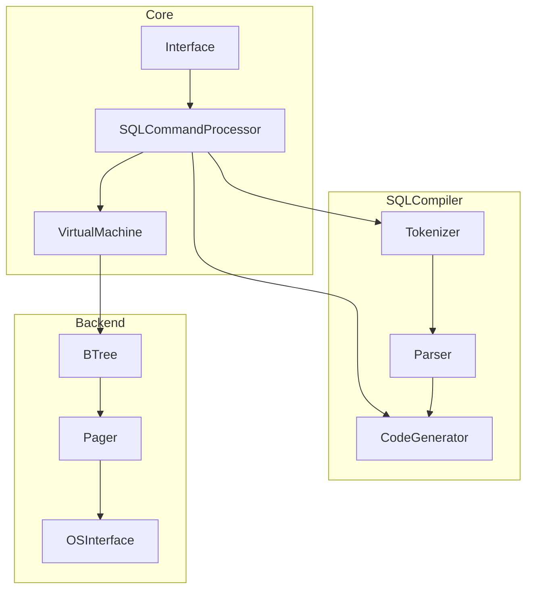

1) Read-Execute-Print Loop (REPL)
2) Simplest Compiler and Virtual Machine
3) In-Memory, Append-Only , Single Table DB
	1) Insert, Print
	2) In Memory
	3) Single, Hard-Coded Table
	4) serialize and deserialize

| column   | size (bytes) | offset |
| -------- | ------------ | ------ |
| id       | 4            | 0      |
| username | 32           | 4      |
| email    | 255          | 36     |
| total    | 291          |        |

4) Tests
5) Persistence to Disk