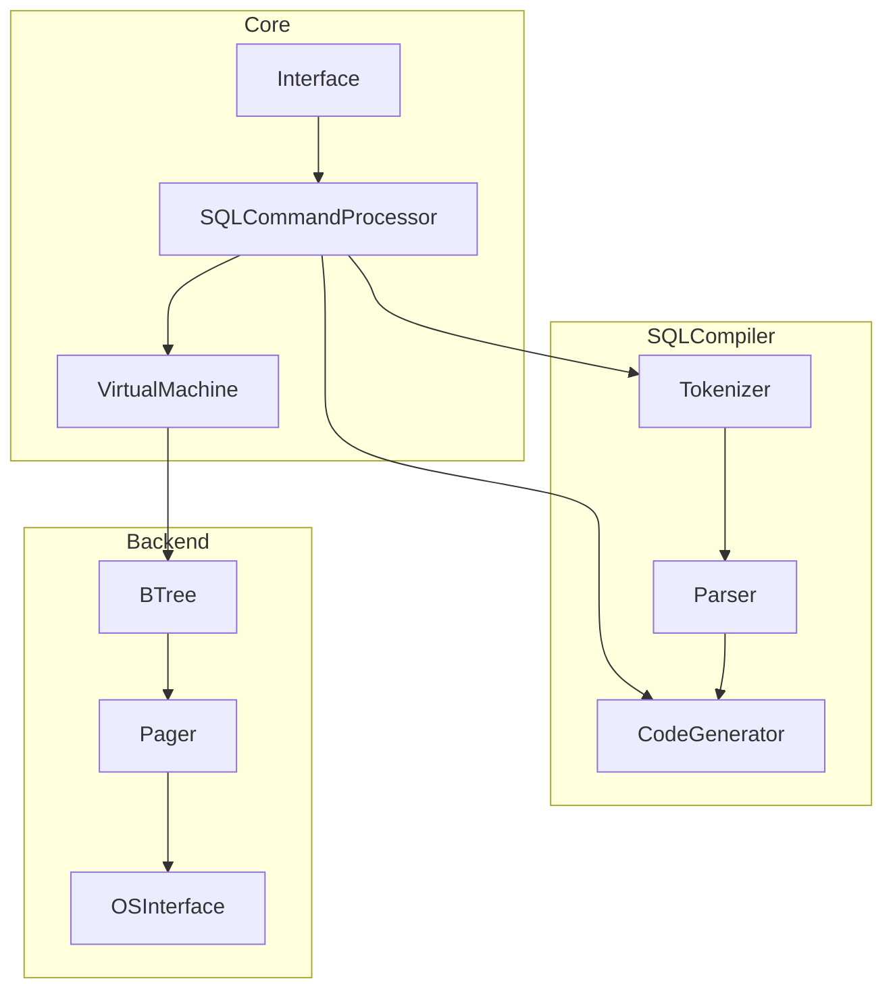

```mermaid
flowchart TD
  %% Section Titles
  subgraph Core
    Interface --> SQLCommandProcessor
    SQLCommandProcessor --> VirtualMachine
  end

  subgraph SQLCompiler
    Tokenizer --> Parser
    Parser --> CodeGenerator
    SQLCommandProcessor --> Tokenizer
    SQLCommandProcessor --> CodeGenerator
  end

  subgraph Backend
    VirtualMachine --> BTree
    BTree --> Pager
    Pager --> OSInterface
  end
```

1) Read-Execute-Print Loop (REPL)
2) Simplest Compiler and Virtual Machine
3) In-Memory, Append-Only , Single Table DB
4) 