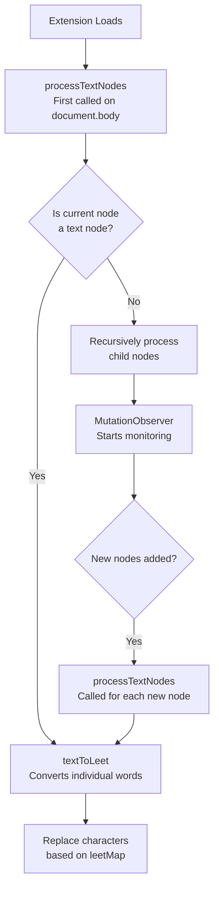
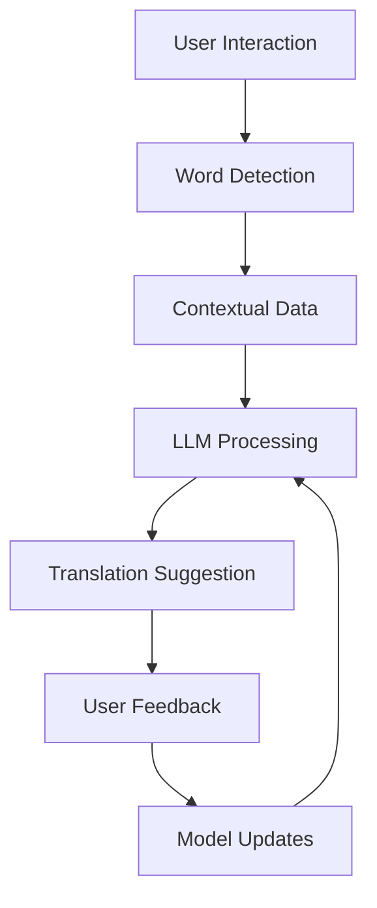

# Research
1) DeiSAM: Segment Anything with Deictic Prompting
2) 1) the AdapT (Adaptive Teaching) evaluation framework & 2) AToM ⚛️ (Adaptive Teaching tOwards Misconceptions), a new probabilistic teaching method.
# Tools 
1) Livekit ?for voice
2) 

# Growth Strategies
1)

# To Sell
1) Flippa
2) 

# Funding

https://x.com/Jason/status/1865098560959844859

# Papers
1) Towards Feature Engineering with Human and AI's Knowledge: Understanding Data Science Practitioners' Perceptions in Human & AI-Assisted Feature Engineering Design
2) 
# Influencers
- Doobydobap -> Denmark ?
- Magnasun -> Spain ?
- 
# Leetspeak Variation

Cayden Pierce

What when through your mind when you read the title ? That is what I am trying to replicate.

1) Sylabbus
2) SRS ? <- air katakana
3) Conjugations
4) svo vs sov style
5) Stephen Krashen's Comprehensible Input Hypothesis
6) Scaffolding - accelerative integrated methology
	1) high-frequency vocab and grammar structures

Part of sentence ? 
1) Proposition
2) Pronoun

Dolch Level

Type of Sentence ?
1) Complex ETC

- **User Interaction**: The user hovers or focuses on a word.
- **Word Detection**: The system identifies the word.
- **Contextual Data**: The surrounding context (e.g., sentence) is gathered.
- **LLM Processing**: The LLM processes the word and context.
- **Translation Suggestion**: The LLM suggests a translation.
- **User Feedback**: The user can accept or reject the translation.
- **Model Updates**: Feedback is used to update and fine-tune the model.

User Profile - embedding
each user profile to capture their specific corrections, preference, and behavior.
1) Word-Specific Preference: What translation they prefer for specific words, including context.
2) Corrective Patterns: User tend  to reject certain kinds of translations (e.g. overly technical or colloquial terms).
3) Set as embedding vector

## Modal Adjustment
1) User Embedding Vector
2) Prompting Adjustment

1. **Initial Interaction**: User interacts, and a random embedding is created.
2. **Model Suggestion**: The LLM uses the embedding and the context to generate a translation.
3. **Feedback**: The user either accepts or rejects the translation. If they reject, they provide a correction.
4. **Embedding Update**: The user’s embedding is updated based on the feedback, either directly or periodically.
5. **Next Interaction**: The model uses the updated embedding to adjust its response, improving the user experience over time.

----
### Key Requirements:

- **Accept**: The user is comfortable with the translation provided and doesn’t need to see the original word.
- **Reject**: The user isn’t ready for the translation (usually when the system moves too fast), and they ask to see the original language word. This means they are not ready to learn that particular word at the moment.

### Step-by-Step Walkthrough for Handling User Feedback:

---

### 1. **Initial Interaction and Model Behavior**:

- **When the user is browsing**: As the user reads the content (e.g., a webpage, a book, etc.), the system starts identifying **foreign words** that might need to be translated.
- The system doesn’t automatically translate everything—**only specific words** are translated based on **user progress** (whether they have already learned or are close to understanding those words).

---

### 2. **User Accepts Translation**:

- **User Behavior**: The user reads a sentence that includes a mix of familiar and new foreign words. If they **understand the translation** and **don’t need to ask for the original word**, this is considered a **successful learning moment**.
- **System Response**: The LLM records that the user **understood** the translation and adjusts the user’s profile accordingly.
- **Feedback**: The system stores this as an **accepted interaction** (i.e., the user is ready for these kinds of translations).
- **Effect on User Embedding**:
    - When the system sees the user accepts the translation, it **reinforces** the user embedding by adjusting the preferences toward translating similar words more freely, as they seem to be ready.

**Example**:

- **Sentence**: "I went to the bibliothèque."
- **Translation Provided**: "I went to the library."
- **Feedback**: The user doesn't right-click for the original word, so it is accepted.

---

### 3. **User Rejects Translation (Asks for Original Word)**:

- **User Behavior**: The system translates a word (e.g., “bibliothèque”), but the user **right-clicks** and asks for the original word because they don’t yet understand it.
- **Feedback Interpretation**: This means the **user is not ready** for the translation of that word yet. It indicates that the **user needs more exposure** to that word or context before it's ready to be fully understood.
- **System Response**: The system interprets this as a **rejection**, and the model adjusts the **user’s profile** to reflect that they’re not yet comfortable with that specific translation.
- **Effect on User Embedding**:
    - The **user embedding** is updated to **slow down** the introduction of that specific word or words with similar context.
    - The model will **avoid** offering translations of this word again too quickly, allowing the user more time to familiarize themselves with it.
    - The model might provide **more exposure** to simpler or related words to prepare the user for future learning.

**Example**:

- **Sentence**: "I went to the bibliothèque."
- **Translation Provided**: "I went to the library."
- **Feedback**: The user **right-clicks** and asks for the original word (bibliothèque). This means they aren’t ready to accept that translation yet.

**Model Update**:

- The **user embedding** is updated to reflect this **rejection** and delays future translations of this word until the user seems more ready.

---

### 4. **User-Specific Embedding Update**:

- The **user embedding** stores the user’s feedback pattern:
    - **Accepted translations** increase the confidence in the system’s translation choices for the user, reinforcing the user's familiarity with certain words.
    - **Rejected translations** (where the user asks for the original word) adjust the system’s model, lowering confidence in translating that particular word and influencing the system to **slow down** or **expose more context** for that word in the future.

**For example**:

- The user embedding might look like:
    
    css
    
    Copy code
    
    `UserEmbedding = [0.1, 0.2, -0.5, 0.3, -0.1]`
    
    - The vector values represent preferences like word familiarity, user readiness, and translation complexity.
    - **After Acceptance**: If the user accepts, some values in the vector might increase (indicating confidence in certain word types or translations).
    - **After Rejection**: If the user rejects, specific values decrease (indicating that the word or translation approach needs to slow down).

---

### 5. **Adaptation in Future Interactions**:

- The system now uses the **updated user embedding** in **future interactions** to:
    - **Personalize translations**: It will be more cautious when offering translations of words that the user previously rejected.
    - **Improve word selection**: If a word is rejected frequently, the system might provide more context (e.g., a sentence with the word or a related word) or expose the user to simpler versions of the word until they are ready for a translation.

**Example**:

- **Next Sentence**: "I went to the bibliothèque to study."
- If the user previously rejected "bibliothèque", the system might:
    - Show the word "bibliothèque" with **no translation**, providing more context or explanation.
    - Or provide a **simpler translation** like "library" in the **original language**, so the user gets more exposure to the word.

---

### 6. **Updating the Model Periodically**:

- **Active Learning**: The model doesn’t need to update after every individual interaction, but periodically it will **retrain** using aggregated user feedback.
    - The retraining process will use the **rejection/acceptance data** to further fine-tune the model.
    - This ensures that as more users interact and provide feedback, the model continuously improves at identifying when a user is ready for a translation and when to hold off.

---

### Summary of the Workflow:

1. **User Interaction**: User encounters a foreign word while browsing.
2. **Model Decision**: The system decides whether to translate the word based on the user’s progress and readiness.
3. **Feedback**:
    - **Accepted**: User is ready for the translation. Model adjusts to confirm the user’s readiness for future similar words.
    - **Rejected**: User is not ready. Model adjusts to delay or reconsider translating that word too soon in the future.
4. **User Embedding**: Feedback updates the user’s profile (embedding), which influences future translations.
5. **Model Adaptation**: The system adapts its behavior for the individual user, balancing between translating words when the user is ready and giving more exposure when they are not.

UserEmbedding = [WordFamiliarity, FormalTranslationPreference, CorrectionFrequency, ContextualUnderstanding, UserReadinessForNewWords]

Loss Function: How well the system's output (semi-translation) matches the desired outcome (whether the user accepted or rejected the translation). 

| C

| Component                  | Tech                       | Purpose                                                                                        |
| -------------------------- | -------------------------- | ---------------------------------------------------------------------------------------------- |
| Frontend                   | JS                         |                                                                                                |
| Backend API                | FastAPI                    | orchestra request  <> vector db, openai and frontend                                           |
| vector db                  |                            | user embedding                                                                                 |
| openai api                 |                            |                                                                                                |
| feedback processor         | part of the JS -> fast API | process user feedback                                                                          |
| log storage                | elasticsearch              |                                                                                                |
| real-time feedback system  | Kafka, RabbitMQ            | process feedback asynchronously to ensure embeddings are updated without latency               |
| Model Fine-Tuning Pipeline | Airflow, Sagemaker         | Aggregates user feedback for periodic fine-tuning of LLM to improve personalization over time. |
| Monitoring and scaling     | Prometheus + Grafana       |                                                                                                |
|                            |                            |                                                                                                |
